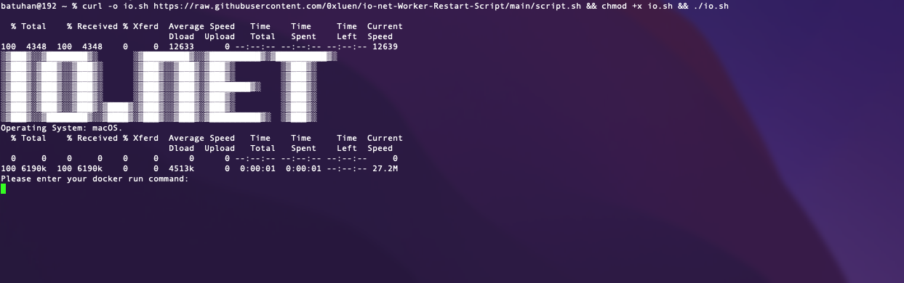
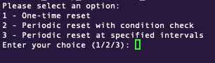
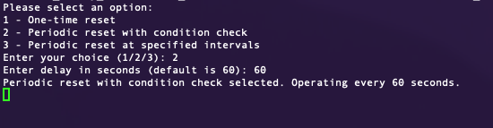

# User Documentation: IO.Net Reset & Auto Restart

#### This document explains how to perform automatic resetting and control operations for io.net containers.
### Türkçe döküman için <a href="readmeTR.md"> Tıklayınız  </a>
## Usage

### 1. Running the Script

Paste the following command into your terminal:

<pre class="bash"><code>curl -o io.sh https://raw.githubusercontent.com/0xluen/io-net-Worker-Restart-Script/main/script.sh && chmod +x io.sh && ./io.sh

</code></pre>

### 2. Worker Command

* At this step, we will use the launch command that we used when creating the Worker. You can access the command by selecting the relevant worker from the Workers tab.

### 3.  Period Selection

 

* At this step, we choose the working period.
- 1. One-time reset
- 2. Periodic reset with condition check  (Restarting after checking container statuses at certain periods)
- 3. Periodic reset at specified intervals (Regularly restarting at specific intervals)

### 4. Period Selection (If one-time start is not selected)

##### Enter delay in seconds (default is 60):
* You can leave the question as 60 seconds or choose the interval you want the restart process to occur

   

